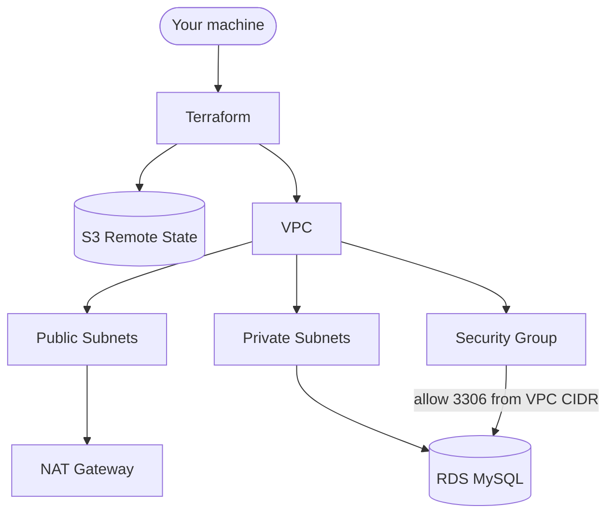

# RDS MySQL on AWS (Terraform)

Provision a production‑ready Amazon RDS for MySQL in private subnets, with a VPC, NAT gateway, and a locked‑down security group. Remote state is stored in S3 (see `backend.tf`).

## What this builds

- VPC with: public and private subnets across AZs, Internet Gateway, single NAT Gateway, route tables and associations
- Security Group: allows inbound MySQL (3306) only from the VPC CIDR; all egress allowed
- RDS MySQL instance: encrypted at rest, in private subnets, with optional KMS key; password auto‑generated unless provided
- Remote Terraform state in S3 (bucket must already exist)



## Layout

- `main.tf` wires modules
- `variables.tf` contains top‑level inputs (region, tags, networking, db_config)
- `outputs.tf` exposes DB attributes (endpoint, port, username, password, etc.)
- `modules/vpc` provisions the network
- `modules/security_groups` creates the DB SG
- `modules/rds` provisions subnet group and the MySQL instance

## Prerequisites

- Terraform >= 1.5 and AWS provider ~> 6.0
- AWS credentials configured with permissions to create VPC, EC2 networking, RDS, and S3 state access
- S3 bucket for remote state exists and is accessible: see `backend.tf`
  - bucket: `aws-terraform-projects-state-bucket`
  - key: `rds-mysql/terraform.tfstate`
  - region: `eu-west-1`

## Inputs (root module)

- `region` (string): AWS region; default `eu-west-1`
- `project_name` (string): used for naming/tagging; default `my-site`
- `tags` (map(string)): common tags applied to all resources
- `networking` (object): VPC configuration
  - `vpc_cidr` (string): e.g. `10.0.0.0/16`
  - `public_subnet_count` (number)
  - `private_subnet_count` (number)
  - `subnet_prefix_length` (number): e.g. `24`
  - `enable_dns_hostnames` (bool)
  - `enable_dns_support` (bool)
- `db_config` (object): RDS configuration
  - `engine` (string): default `mysql`
  - `engine_version` (string): default `8.0.35`
  - `instance_class` (string): e.g. `db.t3.micro`
  - `allocated_storage` (number): default `20` GB
  - `max_allocated_storage` (number): default `100` GB
  - `storage_type` (string): default `gp3`
  - `multi_az` (bool)
  - `db_name` (string)
  - `username` (string)
  - `password` (optional string): if omitted, a secure password is generated
  - `port` (number): fixed at `3306`
  - `publicly_accessible` (bool): default `false`
  - `deletion_protection` (bool): default `true`
  - `backup_retention_period` (number)
  - `backup_window` (string)
  - `maintenance_window` (string)
  - `performance_insights_enabled` (bool)
  - `kms_key_id` (optional string): to use a CMK, else AWS‑managed key is used for RDS
  - `auto_minor_version_upgrade` (bool)
  - `skip_final_snapshot` (bool)

See `variables.tf` for defaults and validations.

## Outputs

- `db_instance_id`: RDS instance identifier
- `db_endpoint`: RDS endpoint hostname
- `db_port`: RDS port (3306)
- `db_username`: master username
- `db_password` (sensitive): password used (provided or generated)
- `db_security_group_id`: security group ID attached to DB
- `db_subnet_group_name`: subnet group name

## Quick start

1) Create a `terraform.tfvars` (or pass `-var` flags) with your values:

```hcl
region       = "eu-west-1"
project_name = "my-rds"

tags = {
  Environment = "Dev"
  ManagedBy   = "Terraform"
  Project     = "RDS-MySQL"
}

networking = {
  vpc_cidr             = "10.0.0.0/16"
  public_subnet_count  = 2
  private_subnet_count = 2
  subnet_prefix_length = 24
  enable_dns_hostnames = true
  enable_dns_support   = true
}

db_config = {
  engine                        = "mysql"
  engine_version                = "8.0.35"
  instance_class                = "db.t3.micro"
  allocated_storage             = 20
  max_allocated_storage         = 100
  storage_type                  = "gp3"
  multi_az                      = false
  db_name                       = "appdb"
  username                      = "admin"
  # password                   = "change-me" # omit to auto-generate
  port                          = 3306
  publicly_accessible           = false
  deletion_protection           = true
  backup_retention_period       = 7
  backup_window                 = "02:00-03:00"
  maintenance_window            = "Sun:03:00-Sun:04:00"
  performance_insights_enabled  = false
  kms_key_id                    = null
  auto_minor_version_upgrade    = true
  skip_final_snapshot           = true
}
```

2) Initialize and deploy:

```sh
terraform init
terraform validate
terraform plan
terraform apply
```

3) Fetch connection info after apply:

```sh
terraform output db_endpoint
terraform output db_username
terraform output -json db_password | jq -r .
```

4) Destroy when done:

```sh
terraform destroy
```

## Connecting to the database

The RDS instance resides in private subnets and is not publicly accessible. Connect from a resource inside the VPC (e.g., an EC2 in a private subnet reachable via SSM Session Manager or a bastion host). Example MySQL client usage after you’re inside the VPC:

```sh
mysql -h <db_endpoint> -P 3306 -u <db_username> -p
```

## Security and safety notes

- Password is generated via `random_password` if not provided; the generated value is returned as a sensitive output
- `deletion_protection` defaults to `true`; set to `false` only when you intend to destroy the instance
- With `skip_final_snapshot = true`, no final snapshot is taken on destroy—consider setting it to `false` for production
- The Security Group only allows 3306 inbound from the VPC CIDR; adjust if you need cross‑VPC access
- Storage is encrypted (`storage_encrypted = true`); supply `kms_key_id` to use a CMK

## Costs

- A NAT Gateway is created (hourly + data processing charges)
- RDS instance, storage, backups, and data transfer incur costs
- EIP for NAT is billable when allocated

## Troubleshooting

- State backend: Ensure the S3 bucket in `backend.tf` exists and your credentials can access it
- Subnet capacity: Make sure `subnet_prefix_length` and subnet counts fit within the `vpc_cidr` capacity
- AZ limits: The module cycles across available AZs; ensure the region has enough AZs for your needs
- Port/engine: The module validates MySQL default port 3306 and engine settings—adjust inputs accordingly

## Development

- Format and validate:

```sh
terraform fmt -recursive
terraform validate
```

- Lint (optional): use `tflint` if installed

---

Maintained as part of the personal AWS Terraform projects. Contributions and tweaks welcome.
